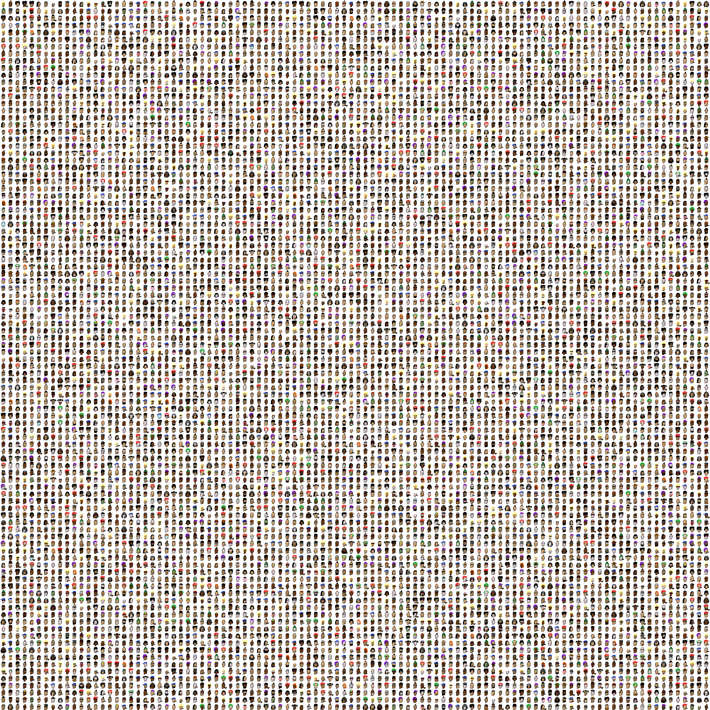

# punks-front-end

Front end for crypto punks vanilla JS application

Back end can be found at github.com/danainjax/punks-api

'punks' is a vanilla javascript application on the front end. A punk is a visual representation of the popular CryptoPunks, the World's first NFT's, non-fungible tokens, first on the blockchain art on Ethereum. This project combines rendering the images of those NFTs and their attributes, the ability to search for a punk by its number (there are over 10,000), a way to 'comment' and 'like' a punk, and coming soon a way to simulate a contract or sale. This project combines features of social media, with basic sale functionality and search.

Built with:

Deployment - Dependencies

Author

License

Acknowledgements

